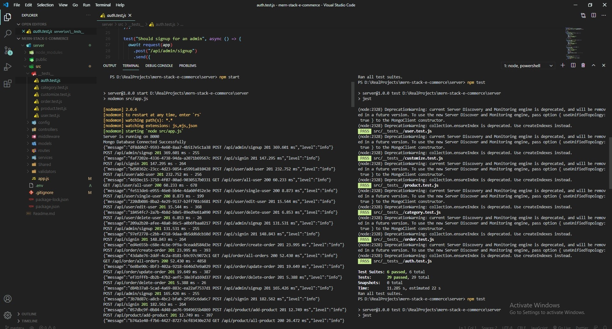

# E-commerce-website

# Follow the following steps to run this project
<h6>$ git clone https://github.com/MahmoudAbuzeed/E-commerce-website </h6> 
<h6>$ cd server </h6>
<h6>$ npm install </h6>
<h3> To run project</h3>
<h6>$ npm start </h6>
<h3> To run test</h3>
<h6>$ npm test </h6>

